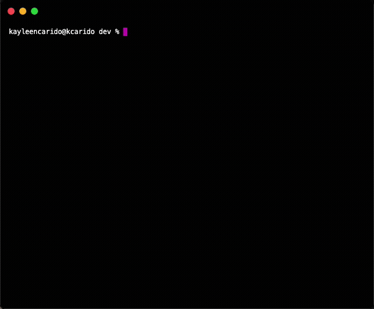

# CloudUploader CLI

A bash-powered command-line interface tool made to streamline file uploads to a cloud storage platform. It offers users a straightforward and effortless uploading process similar to leading storage services.

> This project was created according to the guidelines found in [Learn to Cloud](https://learntocloud.guide/phase1/#capstone-project-clouduploader-cli) ☁️

## Run It Yourself

### Prerequisites

- An AWS subscription – [create one for free](https://aws.amazon.com/)
    - IAM user
    - IAM user group
    - S3 bucket

### How to Setup

Clone the code using `git clone`

Move into the root of the project, where commands are run from a terminal:

|Command    |Action     |
|:----------|:----------|
|`./clouduploader.sh /path/to/file.txt`|Initiates the script and accepts 1 argument, the full path of the file to upload|

## Takeaways

Building this tool was a practical approach to gaining a deeper understanding of popular AWS services through interacting with the command line and bash scripting. 

I wrote about my approach and learnings over [here](https://kayleen.tech/Learning-In-Public/CloudUploader-CLI).
